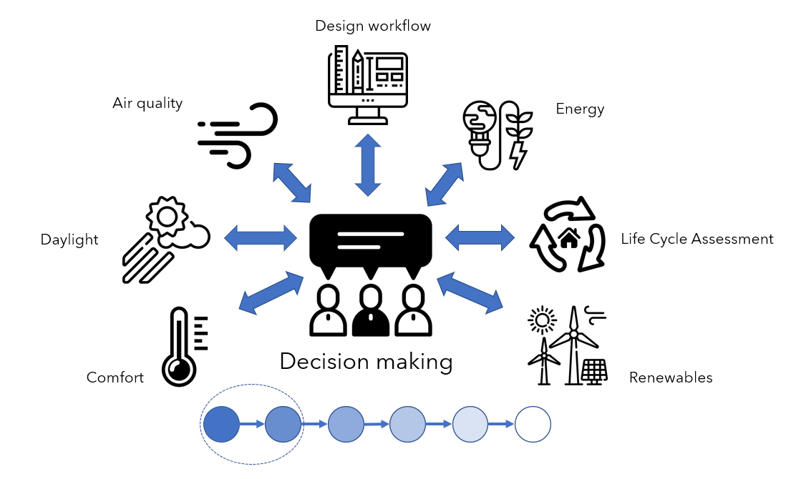

[comment]: <> (Book an interview date here -)
[comment]: <> (<https://choodle.portal.chalmers.se/DigitalTools>)

## Hello there!  
If you work with architecture in early design stages, and would like to explore ways of making more sustainable decisions, we would like to learn from your experiences!  
 
My name is [Toivo Säwén](mailto:sawen@chalmers.se), I’m a PhD student at Chalmers University of Technology.

In our research project, we are developing open-source digital tools that support architects and decision makers to make sustainable decisions in early design stages.

To get detailed updates about the project, please visit [this link](project-updates.md).

If you know someone who might be interested in this project, please share this with them!  
 

*Overview of project themes*

### Project Title - Mainstreaming holistic life cycle performance optimisation in early design stages of buildings
Members - Toivo Säwén, Alexander Hollberg, Angela Sasic Kalagasidis  

Funding - E2B2 (Energimyndigheten)

Project Duration - 2021 - 2026

Target Users – Architects, Engineers, Contractors, Developers, Policymakers, etc.

#### Some of the questions we aim to answer through our project are:
-	To what extent are decisions made in the early design stage informed by sustainability analysis in the current practice?
-	What kind of tools and workflows are being employed for design and analysis in early design stages in the current practice?
-	Who are the stakeholders involved in decision making in early design stages?
 
#### We are conducting a series of stakeholder interviews + observations to:
-	Map early stage design workflows
-	Identify what drives sustainable decisions
-	Identify relevant stakeholders
 
#### Interview to the double
For the interview study, the "interview to the double" technique (ITTD) is used. You will be asked to describe your next workday to the interviewer, pretending that they are a body double who will take over your tasks. Please describe your workday in as much detail as possible! Of course, you remain confidential as per a confidentiality agreement 
sent separately. The interview lasts 30-45 minutes.

#### Observation
For the observation study, I would like to join you in design meetings, both internal with colleagues, and external with clients, to observe when and how conversations about sustainability are being held in early design stages. I would either be interested in following one project over an extended period, or join several meetings in different projects in a more condensed timeframe.

## What's next?
If this seems interesting to you, please let me know when you'd be free for an interview and/or observational study!
[Click here to send an email!](mailto:sawen@chalmers.se)

[comment]: <> (### Interested in the nuts and bolts?)
[comment]: <> (The goal with the digital tool is to stay open-source, and to encourage target users to actively test them as well.)
[comment]: <> (Please take a look at the project homepage for an overview and links to publications <https://snjsomnath.github.io/PhDThesisRepo/>.)
[comment]: <> (As you will see, it is very much a Work-in-Progress, which makes it the perfect time to get inputs from stakeholders like yourself.)

To get detailed updates about the project, please visit [this link](project-updates.md).