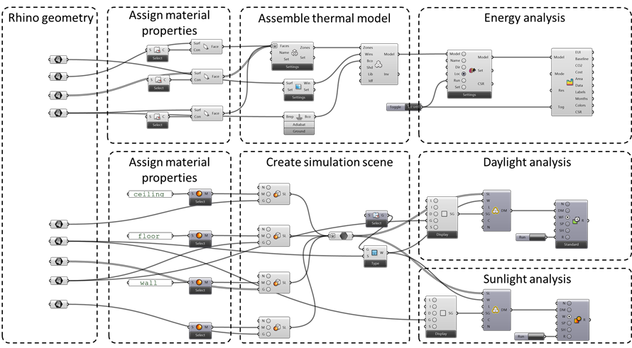
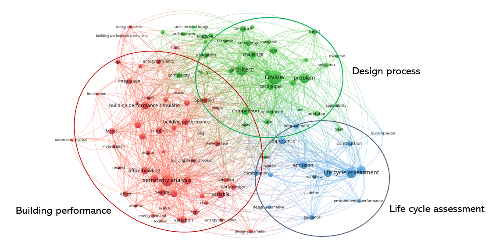

[*back to main page*](index.md)

## Publications

### Reviewing parametric LCA tools applied in early-stage building design
Authors: Toivo Säwén, Emil Magnusson, Alexander Hollberg, Angela Sasic Kalagasidis

Conference: sbe22, Berlin (accepted)

Link: TBA

Abstract: Connecting Life Cycle Assessment (LCA) to parametric design has been suggested as a way of facilitating performing environmental assessments in early design stages. However, no overviews of potential approaches and tools are available. Also, no evaluation frameworks adapted for parametric LCA tools are present. In order to guide the development of frameworks for environmental analysis by architects in the early design stage, the goal of this paper is to provide such a framework, and to use it for a review of available LCA plug-ins for the commonly used parametric design framework Grasshopper®. First, an evaluation framework for classification and characterisation based on workflow, adaptability, and required user knowledge was developed. Second, a tool inventory was performed, identifying 12 parametric LCA plug- ins. Finally, four of these plug-ins were further investigated using the developed evaluation framework, a user persona approach, and a simplified test case. The main defining feature of the tools identified was the level of LCA expertise integrated in the tools, and the allocation of responsibility for data entry and interpretation. A contrast was found between streamlined tools, and tools which provide more versatility. The overview of approaches can be used to guide the future development of parametric environmental analysis frameworks.

Keywords: early-stage design, sustainable architecture, climate-neutral buildings, life-cycle assessment, tool review

*Parametric LCA tool classification scheme*

Last updated: 220513 

### A Benchmarking Framework for Parametric Building Performance Simulation Tools
Authors: Toivo Säwén, Emil Magnusson, Alexander Hollberg, Angela Sasic Kalagasidis

Conference: BuildSim Nordic 2022, Copenhagen (submitted)

Link: TBA

Abstract: Implementing Building Performance Simulation (BPS) in a parametric design framework is a prevalent way of facilitating environmental assessments in early design stages. However, no up-to-date overviews of potential approaches are available, and no benchmarking frameworks adapted for parametric BPS tools are present. In this study, such a framework was developed and applied to investigate eleven available BPS tools for the parametric design framework Grasshopper®. The main defining feature of the tools identified was the level of BPS expertise integrated in the tools, and the allocation of responsibility for data entry and interpretation. A contrast was found between streamlined tools, and tools which provide more versatility. The overview of approaches can be used to guide the future development of parametric environmental analysis frameworks.

Keywords: early-stage design, building performance simulation, tool benchmarking, parametric design, sustainable architecture

*Example Grasshopper definition used for tool review*

Last updated: 220513 

## Unpublished work

### Life Cycle Building Performance Grasshopper Tool
More info coming soon...

Last updated: 220513 

### Literature review

Currently, 390 works covering Life Cycle Assessment, Building Performance Simulation, and Decision Making in Early Design Stages, have been collected.

*Clustering of keywords in abstracts and titles from 177 works*

Last updated: 220513 

### Reference group workshop #1
More info coming soon...

Last updated: 220513 

### Reference group workshop #2
More info coming soon...

Last updated: 220513 